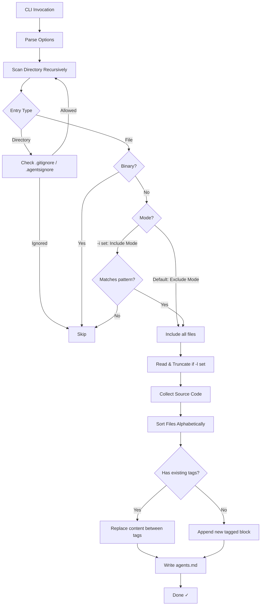

# update-agents-md

[](https://www.npmjs.com/package/update-agents-md)

A tiny, fast, cross-platform Node.js CLI tool to aggregate meaningful source code from a project into a single `agents.md` file (or update an existing one). It respects nested `.gitignore` and `.agentsignore` files.

## Why Use This Tool?

Let's face it: Agents are cool, but it sucks to wait for minutes, and then get a mediocre result when internal context retrieval from vector database hit a semantic limit.
Sub-agent architectures and recursive/graph agent architectures were introduced to address this issue, but they are still in their infancy and often require significant orchestration effort - only to yield even MORE WAIT TIME and COST.

But there's a simple, stupid solution. While VENDORS optimize for cost/RoI (more tokens -> better RoI as YOU PAY), models became less and less limited in their context window.For most projects, when we remove all irrlelevant semantic context, we can fit the entire codebase into the context window by now.

If we do so, we can APPLY THE GENIOUS MOVE: 
- We pay less for tokens as we process the whole codebase, BUT ONLY ONCE.
- We get better results because the model MUST READ ALL CODE before it can start reasoning.
- We get faster results because sub-agents/graphs/recursive agent architectures often become obsolete for code-only reasoning tasks. 

Why? Because simple tool use often is enough in the main agent run to fulfill the task.

**Give AI coding agents complete context in one copy-paste.**

When working with AI assistants (Claude, ChatGPT, Gemini, Copilot, etc.), context is everything. Instead of hoping your IDE integration captures what's needed, `agents.md` contains your entire relevant codebase by running `npx update-agents-md` regularly (e.g. file save action in your IDE):

- **Unlock flexibility - Works with any IDE, any model**: Copy-paste the contents of `agents.md` directly into *any* AI chat interface - no IDE integration required. The model/Agent is now **forced** to see everything it needs, immediately
- **Zero missing context**: The agent sees everything it needs, immediately - no hallucinations caused by sub-optimal vector database retrieval (see paper: [On the Theoretical Limitations of Embedding-Based Retrieval
](https://arxiv.org/abs/2508.21038))
- **Get a second opinion**: Easily share your codebase with alternative models to compare suggestions -- pass these to your Agents via Copy & Paste. Full context cross-model/cross-vendor feedback likely improves code quality when using top-tier models 
- **Works offline**: No API keys or cloud connections needed for the aggregation itself -- you may use local models too; you don't even need an IDE. Now you can manually copy the whole codebase into any web based AI chat interface -- the results will still be stunning (although you'd have to manually merge -- so DO USE IDE's and Agents.. ;).

**Scales well for small to medium projects:**
- ✅ Up to ~50k lines of code: works great
- ✅ 50 - 75k lines: often still fits in modern context windows, but limits may be hit
- ⚠️ Larger projects: use `-i` to filter for most relevant files, or `-l` to truncate context (BAD IDEA, only use if absolutely necessary -- this is the reason why this tool exists in the first place...)

## Features

- **Smart Scanning**: Recursively scans directories, respecting nested gitignore/agentsignore rules
- **Binary Exclusion**: Automatically detects and excludes binary files
- **Metadata Handling**: Updates content between `<full-context-dump>` tags in `agents.md`
- **Documentation Exclusion**: Optionally exclude LICENSE, README, CHANGELOG, and other doc files
- **Include Filters**: Only include files matching specific patterns (exclusive mode)
- **Configurable**: Optional size limits for lines per file and/or total characters

## How It Works



## Installation

```bash
# Run directly with npx (no install required)
npx update-agents-md

# Or install globally
npm install -g update-agents-md
```

## Usage

```bash
update-agents-md [directory] [options]
```

### Options

| Option | Alias | Description |
|--------|-------|-------------|
| `--follow` | `-f` | Follow symbolic links (default: false) |
| `--docs` | `-d` | Exclude documentation files (LICENSE, README, CHANGELOG, etc.) |
| `--include <patterns>` | `-i` | Only include files matching patterns (comma-separated globs) |
| `--lines <n>` | `-l` | Max lines to include per file |
| `--chars <n>` | `-c` | Max total characters to collect |
| `--help` | `-h` | Show help |

### Examples

```bash
# Scan current directory
npx update-agents-md .

# Scan specific directory with line limit
npx update-agents-md ./src -l 50

# Exclude documentation files (LICENSE, README, CHANGELOG, etc.)
npx update-agents-md -d

# Only include TypeScript files
npx update-agents-md -i "*.ts"

# Only include TypeScript and JavaScript files
npx update-agents-md -i "*.ts, *.js"

# Combine options: only TypeScript, exclude docs, limit to 100 lines per file
npx update-agents-md -d -i "*.ts" -l 100
```

## Include Patterns (`-i`)

The `-i` flag enables **exclusive include mode**. When specified, only files matching at least one of the comma-separated glob patterns will be included.

**Important**: `.gitignore` and `.agentsignore` rules still apply! Files excluded by these ignore files will NOT be included even if they match an include pattern.

```bash
# Only include .ts files
update-agents-md -i "*.ts"

# Include .ts and .c files
update-agents-md -i "*.ts, *.c"

# Patterns support wildcards
update-agents-md -i "test*.js, *.spec.ts"
```

### Supported glob syntax
- `*` - matches any characters except `/`
- `?` - matches a single character
- `**` - matches any path (including nested directories)

## Ignore Files

The tool respects:
- `.gitignore` - standard Git ignore patterns  
- `.agentsignore` - custom patterns specific to this tool

If no `.agentsignore` exists, a default one is created with sensible defaults (node_modules, dist, build, coverage, etc.).

## Documentation Files (`-d`)

When `-d` / `--docs` is specified, the following patterns are excluded:
- `*.md`, `*.markdown`, `*.asciidoc`, `*.adoc`, `*.rst`
- `LICENSE`, `LICENSE*`, `LICENSE-*`
- `COPYING`, `COPYING*`
- `CHANGELOG`, `CHANGELOG*`

## Output Format

The tool writes to `agents.md` using this format:

```markdown
<full-context-dump>
./path/to/file.ts:
```ts
// file contents
```

./path/to/another.js:
```js
// file contents
```
</full-context-dump>
```

If `agents.md` already exists with these tags, content between the tags is replaced while preserving any content before or after.

## License

MIT