# update-agents-md

[](https://www.npmjs.com/package/update-agents-md)

A tiny, fast, cross-platform Node.js CLI tool to aggregate meaningful source code from a project into a single `agents.md` file (or update an existing one). It respects nested `.gitignore` and `.agentsignore` files.

## Features

- **Smart Scanning**: Recursively scans directories, respecting nested gitignore/agentsignore rules
- **Binary Exclusion**: Automatically detects and excludes binary files
- **Metadata Handling**: Updates content between `<full-context-dump>` tags in `agents.md`
- **Documentation Exclusion**: Optionally exclude LICENSE, README, CHANGELOG, and other doc files
- **Include Filters**: Only include files matching specific patterns (exclusive mode)
- **Configurable**: Optional size limits for lines per file and/or total characters

## How It Works

```mermaid
flowchart TD
    A[CLI Invocation] --> B[Parse Options]
    B --> C[Scan Directory Recursively]
    
    C --> D{Entry Type}
    D -->|Directory| E[Check .gitignore / .agentsignore]
    E -->|Ignored| F[Skip]
    E -->|Allowed| C
    
    D -->|File| G{Binary?}
    G -->|Yes| F
    G -->|No| H{Mode?}
    
    H -->|Default: Exclude Mode| I[Include all files]
    H -->|"-i" set: Include Mode| J{Matches pattern?}
    J -->|Yes| I
    J -->|No| F
    
    I --> K[Read & Truncate if -l set]
    K --> L[Collect Source Code]
    
    L --> M[Sort Files Alphabetically]
    M --> N{Has existing tags?}
    N -->|Yes| O[Replace content between tags]
    N -->|No| P[Append new tagged block]
    
    O --> Q[Write agents.md]
    P --> Q
    Q --> R[Done ✓]
```



## Installation

```bash
# Run directly with npx (no install required)
npx update-agents-md

# Or install globally
npm install -g update-agents-md
```

## Usage

```bash
update-agents-md [directory] [options]
```

### Options

| Option | Alias | Description |
|--------|-------|-------------|
| `--follow` | `-f` | Follow symbolic links (default: false) |
| `--docs` | `-d` | Exclude documentation files (LICENSE, README, CHANGELOG, etc.) |
| `--include <patterns>` | `-i` | Only include files matching patterns (comma-separated globs) |
| `--lines <n>` | `-l` | Max lines to include per file |
| `--chars <n>` | `-c` | Max total characters to collect |
| `--help` | `-h` | Show help |

### Examples

```bash
# Scan current directory
npx update-agents-md .

# Scan specific directory with line limit
npx update-agents-md ./src -l 50

# Exclude documentation files (LICENSE, README, CHANGELOG, etc.)
npx update-agents-md -d

# Only include TypeScript files
npx update-agents-md -i "*.ts"

# Only include TypeScript and JavaScript files
npx update-agents-md -i "*.ts, *.js"

# Combine options: only TypeScript, exclude docs, limit to 100 lines per file
npx update-agents-md -d -i "*.ts" -l 100
```

## Include Patterns (`-i`)

The `-i` flag enables **exclusive include mode**. When specified, only files matching at least one of the comma-separated glob patterns will be included.

**Important**: `.gitignore` and `.agentsignore` rules still apply! Files excluded by these ignore files will NOT be included even if they match an include pattern.

```bash
# Only include .ts files
update-agents-md -i "*.ts"

# Include .ts and .c files
update-agents-md -i "*.ts, *.c"

# Patterns support wildcards
update-agents-md -i "test*.js, *.spec.ts"
```

### Supported glob syntax
- `*` - matches any characters except `/`
- `?` - matches a single character
- `**` - matches any path (including nested directories)

## Ignore Files

The tool respects:
- `.gitignore` - standard Git ignore patterns  
- `.agentsignore` - custom patterns specific to this tool

If no `.agentsignore` exists, a default one is created with sensible defaults (node_modules, dist, build, coverage, etc.).

## Documentation Files (`-d`)

When `-d` / `--docs` is specified, the following patterns are excluded:
- `*.md`, `*.markdown`, `*.asciidoc`, `*.adoc`, `*.rst`
- `LICENSE`, `LICENSE*`, `LICENSE-*`
- `COPYING`, `COPYING*`
- `CHANGELOG`, `CHANGELOG*`

## Output Format

The tool writes to `agents.md` using this format:

```markdown
<full-context-dump>
./path/to/file.ts:
```ts
// file contents
```

./path/to/another.js:
```js
// file contents
```
</full-context-dump>
```

If `agents.md` already exists with these tags, content between the tags is replaced while preserving any content before or after.

## License

MIT